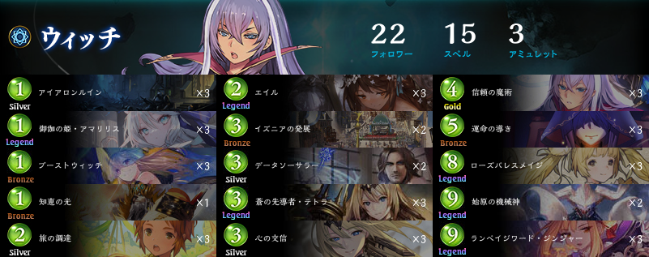

### 概要
- 6キル特化型機械Wと対比して「**エイル型**」「**エイル機械W**」などと呼んでいる。
- エイルの採用により従来苦手対面であるへの相性改善を図るコンセプト。
- エイルの使い方が幅広く、ゲームプランも一直線になりづらい
	- 使ってて楽しい！
---
### 6キルした方が良くない？
- 別に普通に6キルできる。
	- 厳密には6キル特化型に比べて6キル率を落としている
	- その分、総合力が増加している点を評価
- 本当に少しでも6キルした方がいい環境であれば、6キル特化型の使用を推奨
- バランスよくロングゲームも狙いたい環境ならエイル型を使う方が期待勝率が高いと考えている
---
### 構築
- 参考：[HOS RAGE GF持ち込み一覧 - シャドラボ](https://svlabo.jp/blog-entry-884.html)
- [iDeal｜我袖持ち込みリスト](https://shadowverse-portal.com/deck/3.3.7teBY.7teBY.7teBY.7fbGI.7fbGI.7fbGI.7ukVY.7ukVY.7ukVY.5-gkQ.7m09A.7m09A.7m09A.7nDYc.7nDYc.7nDYc.7tb-w.7tb-w.7umxo.7umxo.7urqS.7urqS.7urqS.7ungg.7ungg.7ungg.7uq6w.7uq6w.7uq6w.7n6ya.7n6ya.7n6ya.7urqI.7urqI.7urqI.7tiay.7tiay.7r1hS.7r1hS.7r1hS?lang=ja)

#### 6キル特化型との違い
- 機械神を2枚採用している
	- エイルでテトラをリアニメイトする際、1c機械枚数が不足する場合がある
		- 1c機械の傘増しとしての役割
	- 中盤で相手の盤面にリアクションしながらターンを伸ばしやすい
		- 継戦能力が高いということ
- 大いなる学び舎を不採用としている
	- 学び舎の不採用分、6キル率をやや軽視しているリストである
	- 6キルしないとキツい環境であれば、学び舎を採用してより6キル率を高めた方がいい可能性が高い。
		- そのような環境では、そもそもエイル型機械Wを使用しない方針を検討することも重要
---
### マリガン
- 
	- 6キル特化型と大して違わない。
---
### テトラ算
- 
---
### 対面ごと
#### 狂乱V対面
- W先攻時は「W側回復総量がV側打点総量を上回らないがち」
	- =長引いたらいつか負けると思ってる
	- できるだけ早めに勝つのが正義だけど、揃うかは運 
	- →揃うまで時間を稼ぐことが勝率に直結。
		- →序盤から徹底的にライフカットしたい
		- マリガンではテトラ返してアマリリスを探す
- W側後攻は「W側回復総量がV側打点総量を上回る」
	- =受け切り成功　がぼちぼち発生すると思ってる
	- 手の回復量が多そうならキルより耐久優先
		- イズニアでデータ捨てるとか。
			- どうせ置かせてもらえない
		- 獅子複数枚とかで受け切りの期待値低そうであれば割り切って勝ちに行く
			- 後5データ置き
			- 言霊をテトラに打つ
		- V側の動き見つつ対応
- Tips
	- 先5ヘドネ+鍵盤の形がわかりやすくデータに強い。
		- →痛苦はできるかぎり後2より後3
	- 痛苦で傷ついたテイマーをリペアで回復されるのが地味に辛い。
		- 読み漏らし注意
---
### 盤面例

- 
