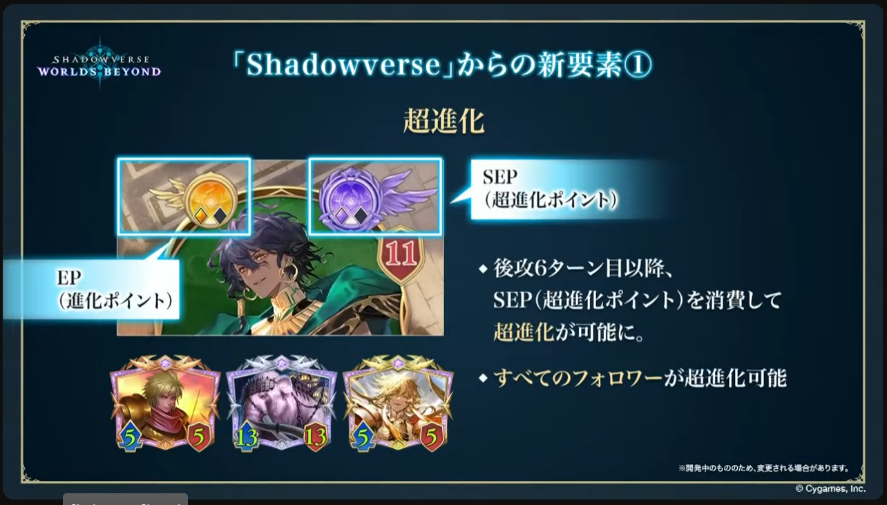
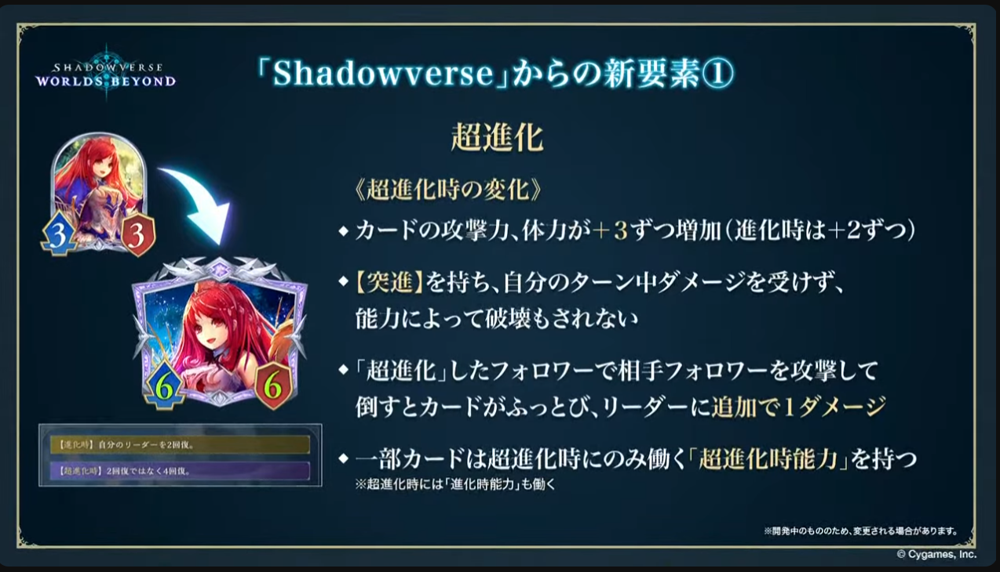
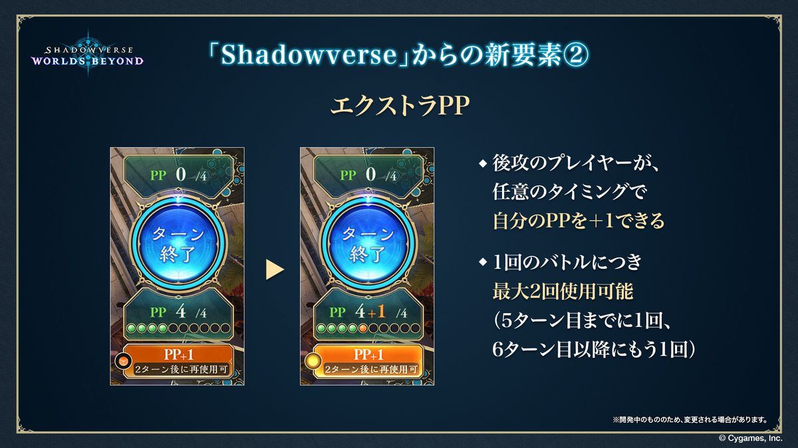

### 参考文献
- [【Shadowverse シャドウバース】Shadowverse: Worlds Beyond 最新情報公開生放送](https://www.youtube.com/live/yjtmgb0bsFw)
---
### 超進化

---
### エクストラPP

---
### キーワード能力の追加
- 威圧
	- 相手のフォロワーから攻撃されない
- オーラ
	- 相手の能力の選択対象にならない
	- 選択不可のこと
- バリア
	- 1度だけ受けるダメージを0にする
---
### その他
- 後攻のEPの数が3個→2個に変更
- マリガン時の手札枚数が3枚→4枚に変更
- 後攻1ターン目のドロー枚数が2枚→1枚に変更
- リーダー付与効果の名称として「クレスト」が採用
	- クレストは最大5個まで保持できる
- NcとVがクラスから削除され、新たに「ナイトメア」が追加