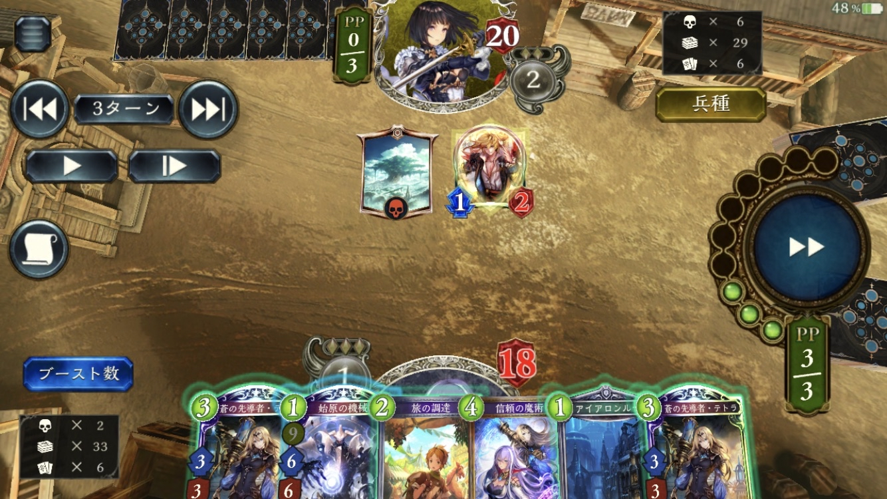

### 実戦
- 適当に機械神プレイ
- →後4テトラ用の1c機械3枚目引けず気まずい状況へ。
#### 機械神をプレイすべきでなかった？
- 機械神を温存する場合、別択が微妙な問題。
	- 調達
		- 混ぜるカードがねぇ
	- 混ぜず調達？
		- その場合アイアロンプレイするのか？
			- アイアロンからの1c機械率は4/7
			- 意外と高いな
		- 機械神はプレイせずアイアロンはプレイしていい可能性はある
	- テトラ置き
		- エイル無しで34でテトラ2枚消費するのは勝つの遠すぎる
#### シンプルにジンジャーが欲しくないか？
- 最大化は調達（信頼融合？）+機械神
	- 機械神のドロー先融合もあるか
#### 自然R対面後攻の大局観が不明なせいでゲームプラン不明
- 耐久ルートがあり得るのか？
- 速攻すべきか？
	- シークレットスキルがだるくて速攻の期待勝率が高すぎることなさそうな気はする
- →盤面処理・回復を手厚く見据えたバランス7キルみたいなルートを見据えたいか